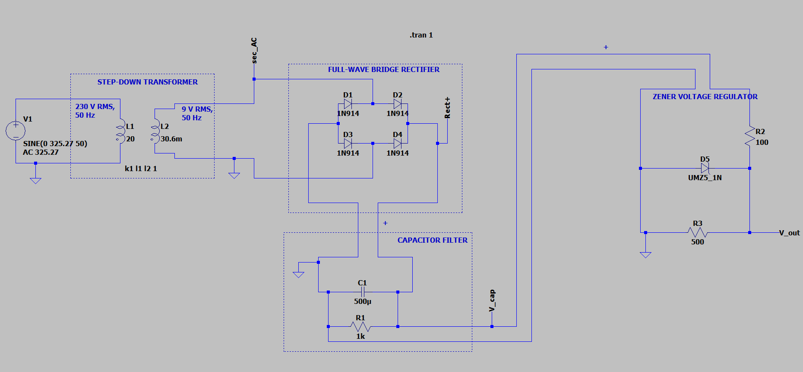

# 5 V Regulated DC Power Supply --- LTspice

A complete LTspice simulation of a basic **AC-to-DC regulated power
supply**, built stage by stage to understand the complete conversion
process from a 230 V AC source to a regulated output of approximately
5.1 V DC.

The project uses a modeled step-down transformer, full-wave bridge
rectifier, capacitor filter, and a Zener diode voltage regulator.

The main focus of the project was to observe how each stage changes the
waveform and how much the final regulator reduces the remaining voltage
ripple.



------------------------------------------------------------------------

## Project Objectives

-   Model a 230 V RMS, 50 Hz AC input in LTspice.
-   Model a step-down transformer using coupled inductors.
-   Convert the transformer output into pulsating DC using a full-wave
    bridge rectifier.
-   Smooth the rectified waveform using a capacitor filter.
-   Regulate the filtered voltage using a 5.1 V Zener diode.
-   Measure the voltage at each important stage of the circuit.
-   Compare the ripple before and after voltage regulation.
-   Study how load resistance affects Zener current and power
    dissipation.

------------------------------------------------------------------------

## Tools Used

### Software

-   LTspice

### Components / Models

-   AC voltage source
-   Coupled inductors for transformer modeling
-   1N914 diodes × 4
-   500 µF capacitor
-   100 Ω series resistor
-   UMZ5_1N Zener diode
-   Load resistors

------------------------------------------------------------------------

## Circuit Overview

The complete conversion chain is:

``` text
230 V AC
    │
    ▼
Step-down Transformer
    │
    ▼
~9 V RMS AC
    │
    ▼
Full-wave Bridge Rectifier
    │
    ▼
Pulsating DC
    │
    ▼
500 µF Capacitor Filter
    │
    ▼
Filtered DC
    │
    ▼
5.1 V Zener Regulator
    │
    ▼
~5.1 V DC
```

The circuit was developed one stage at a time rather than building the
complete circuit immediately. This made it possible to observe the
effect of the transformer, rectifier, capacitor, and regulator
separately.

------------------------------------------------------------------------

# 1. AC Source and Transformer

The input source represents a 230 V RMS, 50 Hz AC supply.

The LTspice source was defined as:

``` text
SINE(0 325.27 50)
```

The 325.27 V peak value comes from:

\[ V\_{peak}=V\_{RMS}`\sqrt{2}`{=tex} \]

\[ V\_{peak}=230`\sqrt{2}`{=tex}`\approx`{=tex}325.27V \]

### Transformer model

Instead of using a dedicated transformer component, the transformer was
modeled using two coupled inductors.

  Parameter                          Value
  ---------------------------- -----------
  Primary inductance                  20 H
  Secondary inductance             30.6 mH
  Coupling coefficient                   1
  Primary voltage                230 V RMS
  Intended secondary voltage       9 V RMS
  Frequency                          50 Hz

The simulated secondary peak voltage was:

**12.71 V**

Converting this back to RMS:

\[ V\_{RMS}=`\frac{12.71}{\sqrt{2}}`{=tex}`\approx`{=tex}8.99V \]

This agrees closely with the intended 9 V RMS secondary.

------------------------------------------------------------------------

# 2. Full-wave Bridge Rectifier

The transformer secondary is connected to a four-diode bridge using
**1N914** diode models.

The bridge rectifier uses both halves of the AC waveform and produces a
full-wave pulsating DC waveform.

The input frequency is 50 Hz, so the rectified waveform has a ripple
frequency of:

\[ f\_{ripple}=2f\_{input} \]

\[ f\_{ripple}=2(50)=100Hz \]

### Measured result

The secondary peak voltage was:

**12.71 V**

After the bridge rectifier, the measured peak voltage was:

**12.68 V**

The small difference is associated with the diode behavior in the
bridge.

------------------------------------------------------------------------

# 3. Capacitor Filter

A **500 µF capacitor** was connected across the rectifier output to
smooth the pulsating DC.

The capacitor charges near the peaks of the rectified waveform and
discharges into the load between peaks.

For the filter-stage measurement, a **1 kΩ load** was used.

### Measured capacitor voltage

  Measurement           Result
  ----------------- ----------
  Maximum voltage      11.87 V
  Minimum voltage      11.43 V
  Ripple              0.44 Vpp

The ripple was calculated as:

\[ V\_{ripple}=V\_{max}-V\_{min} \]

\[ V\_{ripple}=11.87-11.43 \]

\[ `\boxed{V_{ripple}=0.44V_{pp}}`{=tex} \]

The approximate ripple relationship for a capacitor-input full-wave
rectifier is:

\[ `\Delta `{=tex}V`\approx`{=tex}`\frac{I_{load}}{f_{ripple}C}`{=tex}
\]

This also matched the behavior observed during the simulation:
increasing the load current increased the capacitor ripple, while
increasing the capacitance reduced it.

------------------------------------------------------------------------

# 4. Zener Voltage Regulator

The filtered DC was then connected to a simple Zener shunt regulator.

The regulator uses:

-   **UMZ5_1N** Zener diode
-   **100 Ω** series resistor
-   **500 Ω** load for the final regulated-output measurement

The Zener diode is reverse-biased so that it operates in its breakdown
region and maintains an output voltage of approximately 5.1 V.

The series resistor limits the current supplied to the regulator.

The current divides between the load and the Zener:

\[ I_R=I_L+I_Z \]

where:

-   (I_R) = current through the series resistor
-   (I_L) = load current
-   (I_Z) = Zener current

------------------------------------------------------------------------

# Final Regulated Output

With the final regulator and 500 Ω load connected, the measured output
was:

  Measurement                  Result
  ------------------------ ----------
  Maximum output voltage       5.12 V
  Minimum output voltage       5.11 V
  Output ripple              0.01 Vpp

Therefore, the final output was approximately:

\[ `\boxed{5.1V DC}`{=tex} \]

with a measured ripple of only:

\[ `\boxed{0.01V_{pp}}`{=tex} \]

under the tested conditions.

------------------------------------------------------------------------

# Ripple Comparison

One of the main measurements in this project was the change in ripple
before and after regulation.

### Capacitor filter output

``` text
Vmax = 11.87 V
Vmin = 11.43 V
```

\[ V\_{ripple}=0.44V\_{pp} \]

### Final regulated output

``` text
Vmax = 5.12 V
Vmin = 5.11 V
```

\[ V\_{ripple}=0.01V\_{pp} \]

The measured ripple reduction was:

\[ `\frac{0.44-0.01}{0.44}`{=tex}`\times100`{=tex} \]

\[ `\boxed{\approx97.7\%}`{=tex} \]

This was one of the most useful observations from the simulation: the
capacitor filter removes most of the large voltage variation from the
rectified waveform, while the Zener regulator further stabilizes the
output.

------------------------------------------------------------------------

# Zener Power Analysis

The Zener power dissipation was measured under several load conditions.

  Load condition     Zener power
  ---------------- -------------
  100 Ω                  \~80 mW
  500 Ω                 \~289 mW
  1 kΩ                  \~315 mW
  No load             \~341.8 mW

The maximum measured Zener power was:

\[ `\boxed{341.8mW}`{=tex} \]

The highest Zener power occurred under the no-load condition.

This happens because the current through the 100 Ω series resistor still
has to go somewhere. When the load draws less current, a larger portion
of the available current flows through the Zener.

This is an important limitation of a simple shunt regulator: it can
continue dissipating significant power even when the load is drawing
very little current.

------------------------------------------------------------------------

# Experimental Results

The main measured values from the complete simulation are summarized
below.

  Parameter                 Measured Result
  ----------------------- -----------------
  Input voltage                   230 V RMS
  Input frequency                     50 Hz
  Transformer secondary        \~8.99 V RMS
  Secondary peak                    12.71 V
  Rectifier peak                    12.68 V
  Filter capacitor                   500 µF
  Capacitor maximum                 11.87 V
  Capacitor minimum                 11.43 V
  Capacitor ripple                 0.44 Vpp
  Zener nominal voltage             \~5.1 V
  Final output maximum               5.12 V
  Final output minimum               5.11 V
  Final output ripple              0.01 Vpp
  Maximum Zener power              341.8 mW

------------------------------------------------------------------------

# Key Observations

### 1. Transformer step-down

The 230 V RMS input was reduced to approximately 9 V RMS at the
secondary.

### 2. Full-wave rectification

The bridge converted both halves of the AC waveform into a pulsating DC
waveform with a 100 Hz ripple frequency.

### 3. Capacitor filtering

The 500 µF capacitor significantly reduced the variation in the
rectified waveform, producing approximately 11.43--11.87 V across the
filter output under the tested load.

### 4. Voltage regulation

The Zener stage brought the output down to approximately 5.1 V and
greatly reduced the remaining ripple.

### 5. Load dependence

The behavior of the Zener regulator changed with load resistance. Under
lighter loads, more current was available to flow through the Zener,
increasing its power dissipation.

------------------------------------------------------------------------

# What I Learned

This project helped me connect several individual circuit concepts into
one complete power-supply design.

Some of the main concepts I worked with were:

-   RMS and peak voltage
-   AC source modeling in LTspice
-   Transformer modeling using coupled inductors
-   Inductance and voltage transformation
-   Full-wave bridge rectification
-   Diode forward voltage
-   Capacitor charging and discharging
-   Ripple voltage
-   Effect of load resistance on ripple
-   Zener breakdown
-   Shunt voltage regulation
-   Current distribution between a load and Zener
-   Power dissipation
-   Transient simulation and waveform measurement

One of the more useful parts of the project was not just getting the
final 5.1 V output, but observing how the waveform changed at each
stage.

------------------------------------------------------------------------

# Limitations

This project is an LTspice simulation intended for learning and circuit
analysis. It is **not a ready-to-build mains-powered power supply**.

The transformer model uses ideal coupling and does not fully represent
real transformer losses, winding resistance, leakage inductance,
heating, or core behavior.

The Zener regulator is also a simple shunt regulator. It is useful for
understanding voltage regulation, but it is not an efficient solution
for higher-power applications.

A real 230 V mains implementation would require proper isolation,
fusing, insulation, PCB clearances, component ratings, thermal analysis,
and appropriate electrical safety measures.

------------------------------------------------------------------------

# Possible Improvements

There are several directions in which this project could be extended.

### Compare different regulator designs

Replace the Zener regulator with a 7805 or another linear regulator and
compare:

-   Output regulation
-   Ripple
-   Power dissipation
-   Efficiency

### Study capacitor selection

Run the filter stage with different capacitor values and compare the
resulting ripple.

### Wider load analysis

Sweep the load resistance and determine the range over which the Zener
maintains proper regulation.

### Input variation

Vary the input voltage and observe how the output changes.

### Efficiency analysis

Calculate the power delivered to the load and compare it with the power
dissipated in the regulator and series resistor.

### Switch-mode conversion

A future version of the project could replace the linear/Zener
regulation stage with a switching converter to explore the operating
principles behind modern power adapters and chargers.

------------------------------------------------------------------------

# Repository Structure

``` text
.
├── 5V_regulated_power_supply.asc
├── final_schematic.png
└── README.md
```

### Files

**`5V_regulated_power_supply.asc`**

The complete LTspice schematic and simulation.

**`final_schematic.png`**

A screenshot of the final circuit.

**`README.md`**

Project documentation, measurements, observations, and analysis.

------------------------------------------------------------------------

# Software

-   LTspice

------------------------------------------------------------------------

# Project Status

**Completed --- LTspice Simulation**

The complete AC-to-DC conversion chain was modeled and analyzed:

**230 V AC → Transformer → Bridge Rectifier → Capacitor Filter → Zener
Regulator → \~5.1 V DC**

The final simulated output was **5.11--5.12 V** with approximately
**0.01 Vpp ripple** under the tested conditions.

The project can be extended further by comparing different regulation
methods, analyzing efficiency, and eventually building a low-voltage
version as a physical prototype.

------------------------------------------------------------------------

## Final Result

The simulated power supply converts a modeled **230 V RMS, 50 Hz AC
input** into approximately **5.1 V regulated DC**.

### Final measured output

``` text
Vout(max) = 5.12 V
Vout(min) = 5.11 V
Ripple    = 0.01 Vpp
```

### Maximum measured Zener power

``` text
Pz(max) = 341.8 mW
```

The project demonstrates the complete process of stepping down,
rectifying, filtering, and regulating an AC source using basic circuit
building blocks in LTspice.
